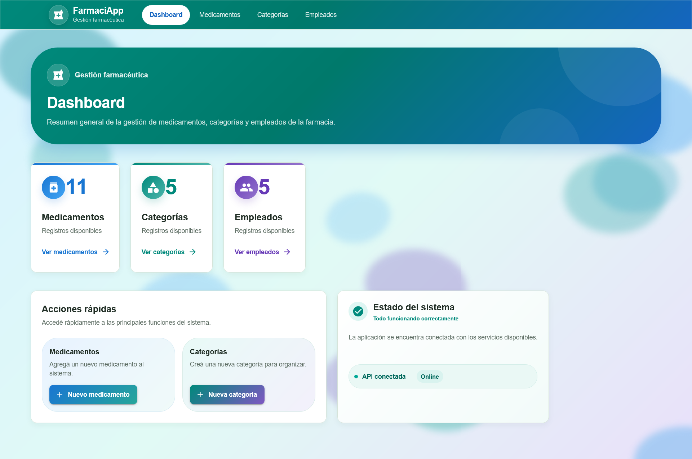
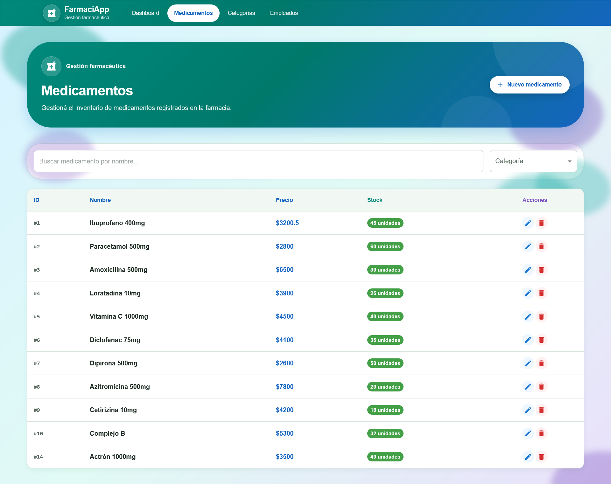
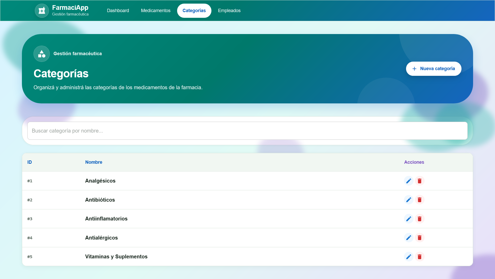
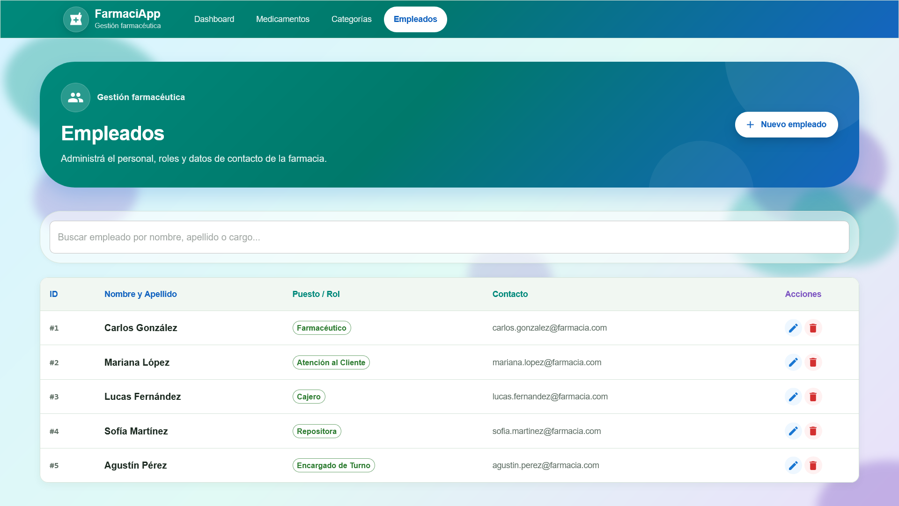

# FarmaciApp
## Sistema de Gestión de Farmacia

## 1. Integrantes

* **Franco Esquivel** — Frontend y documentación.
* **Jonathan Acevedo** — Backend y base de datos.

---

## 2. Descripción

Sistema web para la gestión de una farmacia, desarrollado como trabajo práctico académico.

La aplicación permite administrar medicamentos, categorías y empleados mediante operaciones de consulta, creación, modificación y eliminación. También cuenta con un dashboard para visualizar información general del sistema.

El proyecto está compuesto por un **frontend desarrollado con React** y un **backend desarrollado con Flask**, conectado a una base de datos **MySQL**.

---

## 3. Tecnologías utilizadas

### Frontend

* React
* Vite
* Material UI (MUI)
* JavaScript
* HTML
* CSS

### Backend

* Python
* Flask
* Flask-SQLAlchemy

### Base de datos

* MySQL

### Herramientas

* Git
* GitHub
* Docker
* Visual Studio Code

---

## 4. Requisitos

Para ejecutar el proyecto se requiere tener instalado:

* Python
* Node.js y npm
* Docker Desktop
* Git
* Visual Studio Code u otro editor de código

---

## 5. Instalación de dependencias

### Backend

Ingresar a la carpeta del backend y crear un entorno virtual:

```bash
python -m venv .venv
```

Activar el entorno virtual.

En Windows:

```bash
.venv\Scripts\activate
```

Instalar las dependencias:

```bash
pip install -r requirements.txt
```

### Frontend

Ingresar a la carpeta del frontend:

```bash
cd frontend
```

Instalar las dependencias:

```bash
npm install
```

---

## 6. Configuración de MySQL

La base de datos utilizada por el proyecto es **MySQL**.

El proyecto incluye el archivo:

```text
database/farmacia_db.sql
```

Este archivo contiene la estructura y los datos iniciales necesarios para la base de datos.

También se incluye una configuración mediante **Docker Compose** para ejecutar un contenedor de MySQL.

Para iniciar la base de datos:

```bash
docker compose up -d
```

---

## 7. Configuración del backend

El backend está desarrollado utilizando **Python y Flask**.

Antes de ejecutarlo, se debe activar el entorno virtual:

```bash
.venv\Scripts\activate
```

Luego, ejecutar la aplicación Flask desde la carpeta correspondiente:

```bash
python app.py
```

El backend queda disponible en:

```text
http://127.0.0.1:5000
```

---

## 8. Configuración del frontend

El frontend está desarrollado utilizando **React, Vite y Material UI**.

Desde la carpeta `frontend`, instalar las dependencias:

```bash
npm install
```

Luego iniciar el servidor de desarrollo:

```bash
npm run dev
```

Vite mostrará en la terminal la dirección local donde se encuentra disponible la aplicación.

---

## 9. Cómo ejecutar el proyecto

Para ejecutar el proyecto completo:

### 1. Iniciar la base de datos

Desde la raíz del proyecto:

```bash
docker compose up -d
```

### 2. Iniciar el backend

Activar el entorno virtual y ejecutar Flask:

```bash
.venv\Scripts\activate
python app.py
```

### 3. Iniciar el frontend

Desde la carpeta `frontend`:

```bash
npm run dev
```

Una vez iniciados los tres componentes, se puede acceder a la aplicación desde la dirección indicada por Vite.

---

## 10. Estructura del proyecto

```text
proyecto-farmacia/
│
├── database/
│   └── farmacia_db.sql
│
├── backend/
│   ├── app.py
│   ├── config.py
│   ├── controllers/
│   ├── database/
│   ├── models/
│   ├── routes/
│   └── requirements.txt
│
├── frontend/
│   ├── public/
│   ├── src/
│   │   ├── components/
│   │   │   └── Navbar.jsx
│   │   ├── services/
│   │   │   └── api.js
│   │   ├── views/
│   │   │   ├── Dashboard.jsx
│   │   │   ├── Medicamentos.jsx
│   │   │   ├── Categorias.jsx
│   │   │   └── Empleados.jsx
│   │   ├── App.jsx
│   │   ├── main.jsx
│   │   └── theme.js
│   ├── package.json
│   └── vite.config.js
│
├── docker-compose.yml
└── README.md
```

---

## 11. Capturas de pantalla

### Dashboard



### Medicamentos



### Categorías



### Empleados



---

## 12. Funcionalidades principales

### Medicamentos

* Listado de medicamentos.
* Búsqueda por nombre.
* Filtrado por categoría.
* Creación de medicamentos.
* Edición de medicamentos.
* Eliminación de medicamentos.

### Categorías

* Listado de categorías.
* Creación de categorías.
* Edición de categorías.
* Eliminación de categorías.

### Empleados

* Listado de empleados.
* Creación de empleados.
* Edición de empleados.
* Eliminación de empleados.

### Dashboard

* Visualización general de información del sistema.

---

## 13. Distribución general de tareas

### Franco Esquivel — Frontend y documentación

* Desarrollo del frontend con React.
* Implementación de las vistas y navegación.
* Desarrollo de formularios y operaciones CRUD.
* Diseño y adaptación responsive de la interfaz.
* Integración del frontend con la API del backend.
* Documentación del proyecto.
* Preparación del README.

### Jonathan Acevedo — Backend y base de datos

* Desarrollo del backend con Flask.
* Desarrollo de la API y sus endpoints.
* Modelado y configuración de la base de datos MySQL.
* Implementación de las operaciones del sistema.
* Configuración del entorno de base de datos.
